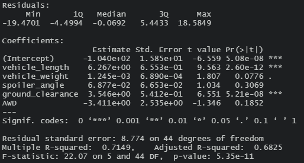
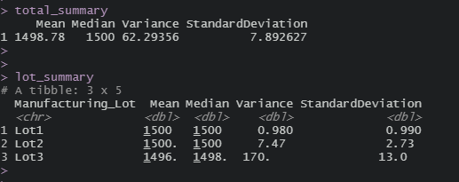
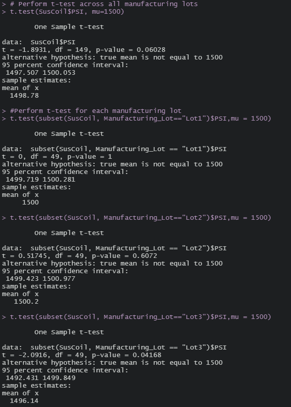

# MechaCar Statistical Analysis

## Overview

The purpose of this project is analyze two datasets provided to see if any insights can be gathered to see why the production of AutosRU's newest prototype, the MechaCar is suffering from production troubles that are blocking the manufacturing team's progress.

## Resources

- Data Source: MechaCAr_mpg.csv, Suspension_Coil.csv
- Software: RStudio 1.3.1073, Atom 1.53.0 x64

## Linear Regression to Predict MPG

**Which variables/coefficients provided a non-random amount of variance to the mpg values in the dataset?**

- The vehicle_length and the ground_clearance variables provided a non-random amount of variance to the mpg values in the dataset. The p-values were small showing that there was a high level of significance.

**Is the slope of the linear model considered to be zero? Why or why not?**

- The slope of the linear model is not considered to be zero due to the p-value being less than the 0.05% level of significance.

**Does this linear model predict mpg of MechaCar prototypes effectively? Why or why not?**

- We can assume that this linear model is effective in predicting mpg of MechaCar prototypes because the r-square is 0.71 or 71% correct in its predictions.

## Summary Statistics on Suspension Coils

**The design specifications for the MechaCar suspension coils dictate that the variance of the suspension coils must not exceed 100 pounds per square inch. Does the current manufacturing data meet this design specification for all manufacturing lots in total and each lot individually? Why or why not?**

- The total summary shows that the variance of all lots is 62.29. This number overall isn't terrible yet when we look at the lots individually we see that the variance for lot 3 is 170 and lot 1 and lot 2 are 0.98 and 7.47. A high variance shows how far the data is spread out from the mean. Lot 3 needs to be looked at and fixed so that the variance of the suspension coils does not exceed 100 pounds per square inch.

## T-Tests on Suspension Coils

## Study Design: MechaCar vs Competition

- As we are now living in a drastically changing world where the future of fossil fuels is unknown, it might be important for a consumer to look at fuel efficiency or possibly maintenance cost due to higher cost of living and less good paying jobs.

**What metric or metrics are you going to test?**

- Metrics that could be tested annual costs to maintain the MechaCar and this could be compared to the annual maintenance costs of the competition.

**What is the null hypothesis or alternative hypothesis?**

- The null hypothesis is that the MachaCar has the same annual maintenance costs of the competition and the alternative hypothesis is that they differ.

**What statistical test would you use to test the hypothesis? And why?**

- I would use the ANOVA test to see is there is a statistical difference between the distribution means from multiple samples.

**What data is needed to run the statistical test?**

- A sample size of 100 plus cars and their annual maintenance costs with similar metrics as the MechaCar.
